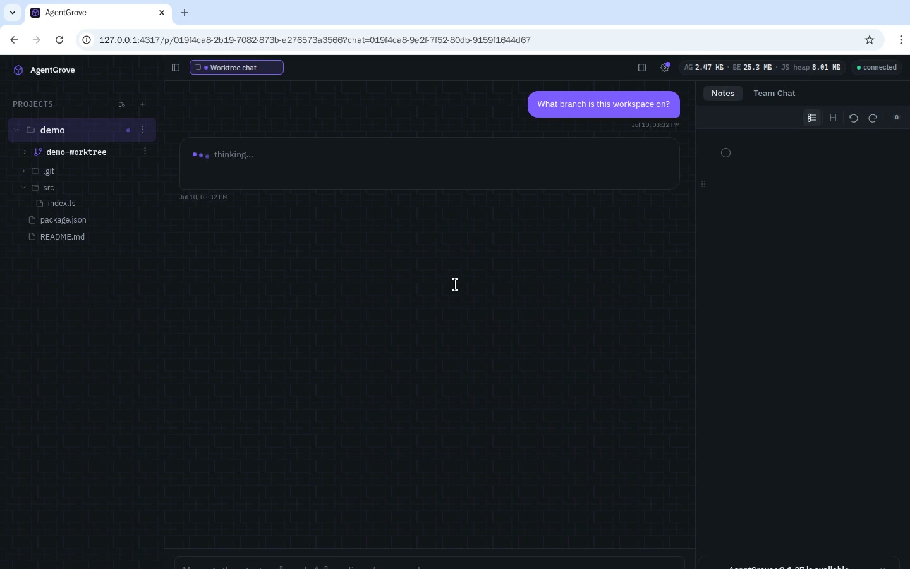
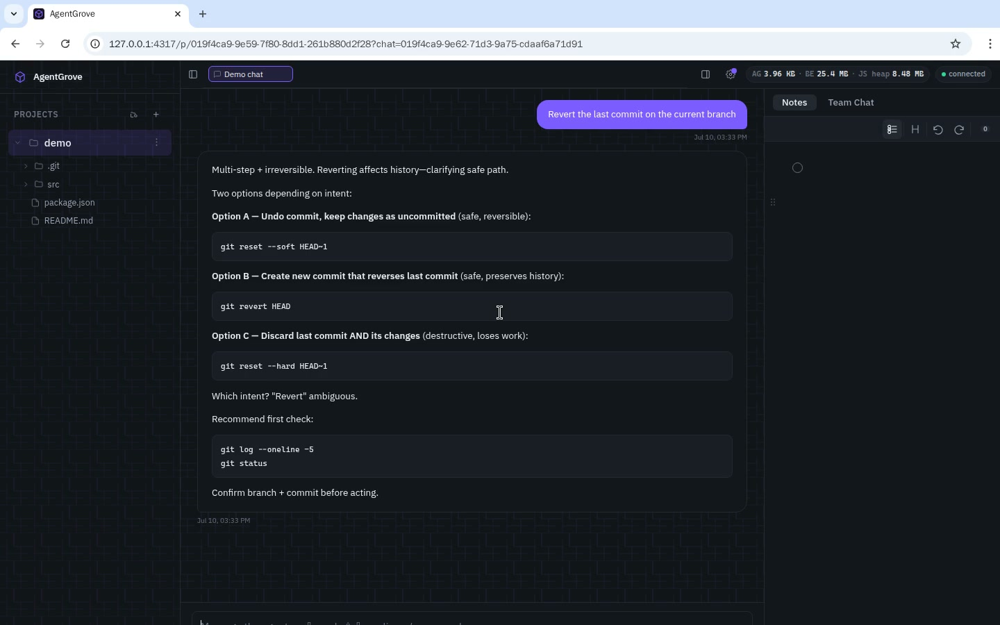
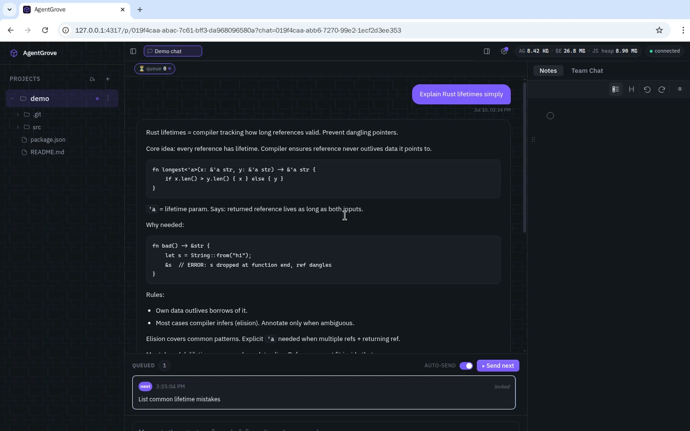
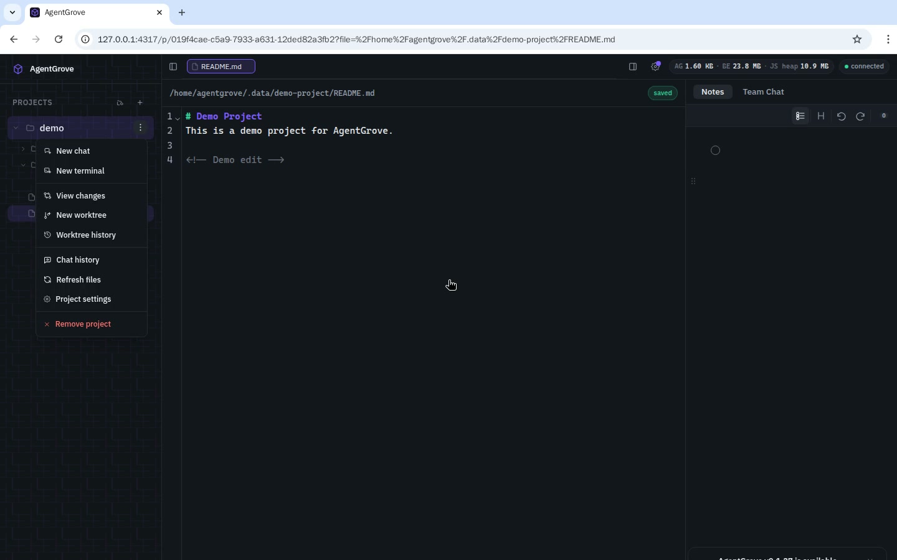
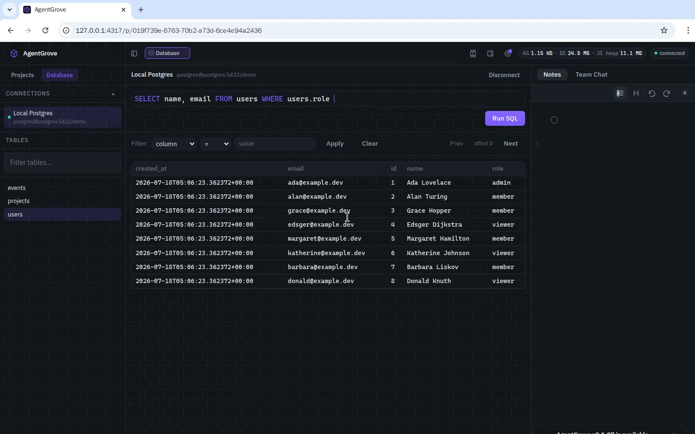

# AgentGrove

[](https://github.com/arnabk/agentgrove/actions/workflows/ci.yml)
[](https://github.com/arnabk/agentgrove/actions/workflows/release.yml)
[](https://github.com/arnabk/agentgrove/actions/workflows/nightly.yml)

High-performance, low-footprint, open-source local developer workspace.
Rust backend + SolidJS frontend. Cross-platform (Linux, macOS, Windows).

## Features

See [docs/features.md](docs/features.md) for the full feature list.

## Demo Videos

Click any thumbnail to watch the screen recording. All videos are real captures of the live app, recorded inside the Docker container on the isolated demo stack so the host dev server is untouched.

| Feature | Recording |
| --- | --- |
| **Overview** — workspace layout, rail, sidebar, project list | [](./docs/demos/overview.mp4) |
| **AI Chat** — streaming response with real typing and code blocks | [](./docs/demos/ai-chat.mp4) |
| **Terminal** — integrated shell running real commands | [](./docs/demos/terminal.mp4) |
| **File Search (Cmd+P)** — fuzzy file finder across the project | [](./docs/demos/file-search.mp4) |
| **Notes Scratchpad** — persistent markdown scratchpad | [](./docs/demos/notes.mp4) |
| **Prompt Queue** — queue a prompt and run it through the AI | [](./docs/demos/prompt-queue.mp4) |
| **Team Chat** — shared channel with messages and reactions | [](./docs/demos/team-chat.mp4) |
| **Settings** — appearance, themes, and preferences | [](./docs/demos/settings.mp4) |
| **Layout Toggles** — collapse and restore the left rail and sidebar | [](./docs/demos/layout.mp4) |
| **Worktree Sessions** — start isolated workspaces per Git branch | [](./docs/demos/worktree.mp4) |
| **Revert with AI** — ask the agent to undo the last commit | [](./docs/demos/revert.mp4) |
| **Queue Thoughts** — queue multiple prompts and wait for each to finish | [](./docs/demos/queue-thoughts.mp4) |
| **Git Diff View** — inspect staged and unstaged changes | [](./docs/demos/git-diff.mp4) |
| **DB Editor** — saved connections, table browser, SQL editor with autocomplete | [](./docs/demos/db-editor.mp4) |

## Quick Start

```sh
# Install prerequisites (macOS with Homebrew)
brew install node pnpm just
# Rust toolchain — project pins 1.95 via rust-toolchain.toml
curl --proto '=https' --tlsv1.2 -sSf https://sh.rustup.rs | sh

# Clone and run
git clone https://github.com/arnabk/agentgrove.git
cd agentgrove
just dev    # starts BE (hot reload) + FE (HMR) on http://localhost:5173
```

On Linux, install the same packages with your distro's package manager (e.g., `apt install nodejs pnpm` or `pacman -S node pnpm just`). Windows users can use `winget install Rustlang.Rustup OpenJS.NodeJS pnpm.just` or the [rustup](https://rustup.rs/) and [pnpm](https://pnpm.io/installation) installers.

## Documentation

All detailed docs live under [`docs/`](./docs/):

- [Features](./docs/features.md)
- [Roadmap (working draft)](./docs/roadmap/README.md)
- [Architecture](./docs/architecture/overview.md)
- [Contributing](./docs/CONTRIBUTING.md)
- [Local dev guide](./docs/guides/local-dev.md)
- [Agent providers](./docs/guides/agent-providers.md)
- [Chat & queue routing](./docs/architecture/chat-queue-routing.md)
- [Data safety & restore](./docs/operations/data-safety.md)
- [Comparison with other tools](./docs/comparison.md)
- [ADRs](./docs/adr/)

## License

[MIT](./LICENSE)
