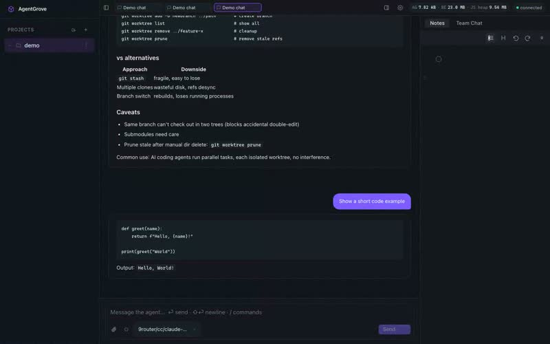

# AgentGrove

[](https://github.com/arnabk/agentgrove/actions/workflows/ci.yml)
[](https://github.com/arnabk/agentgrove/actions/workflows/release.yml)
[](https://github.com/arnabk/agentgrove/actions/workflows/nightly.yml)

High-performance, low-footprint, open-source local developer workspace.
Rust backend + SolidJS frontend. Cross-platform (Linux, macOS, Windows).

## Features

See [docs/features.md](docs/features.md) for the full feature list.

## Demo Videos

Click any thumbnail to watch the full `.webm` demo.

A quick walkthrough of the AgentGrove workspace — project tree, new-chat dialog, and layout.

[](./docs/demos/overview.webm)

### AI Chat

Ask questions with a real provider; watch token-by-token streaming and tool activity in the timeline.

[](./docs/demos/ai-chat.webm)

### Team Chat

Chat with other developers on the same instance from the right-side panel. Unread messages show a dot when the panel is closed.

[](./docs/demos/team-chat.webm)

### Prompt Queue

Send follow-up messages while the agent is busy; they enqueue automatically and drain back-to-back.

[](./docs/demos/prompt-queue.webm)

### Settings

Tabbed settings for appearance, prompt templates, providers, agents, and database backups.

[](./docs/demos/settings.webm)

### Layout Toggles

Collapse and expand the left rail to make room for the main workspace.

[](./docs/demos/left-rail-toggle.webm)

## Quick Start

```sh
# Install prerequisites (macOS with Homebrew)
brew install node pnpm just
# Rust toolchain — project pins 1.95 via rust-toolchain.toml
curl --proto '=https' --tlsv1.2 -sSf https://sh.rustup.rs | sh

# Clone and run
git clone https://github.com/arnabk/agentgrove.git
cd agentgrove
just dev    # starts BE (hot reload) + FE (HMR) on http://localhost:5173
```

On Linux, install the same packages with your distro's package manager (e.g., `apt install nodejs pnpm` or `pacman -S node pnpm just`). Windows users can use `winget install Rustlang.Rustup OpenJS.NodeJS pnpm.just` or the [rustup](https://rustup.rs/) and [pnpm](https://pnpm.io/installation) installers.

## Documentation

All detailed docs live under [`docs/`](./docs/):

- [Features](./docs/features.md)
- [Architecture](./docs/architecture/overview.md)
- [Contributing](./docs/CONTRIBUTING.md)
- [Local dev guide](./docs/guides/local-dev.md)
- [Agent providers](./docs/guides/agent-providers.md)
- [Chat & queue routing](./docs/architecture/chat-queue-routing.md)
- [Data safety & restore](./docs/operations/data-safety.md)
- [Comparison with other tools](./docs/comparison.md)
- [ADRs](./docs/adr/)

## License

[MIT](./LICENSE)
