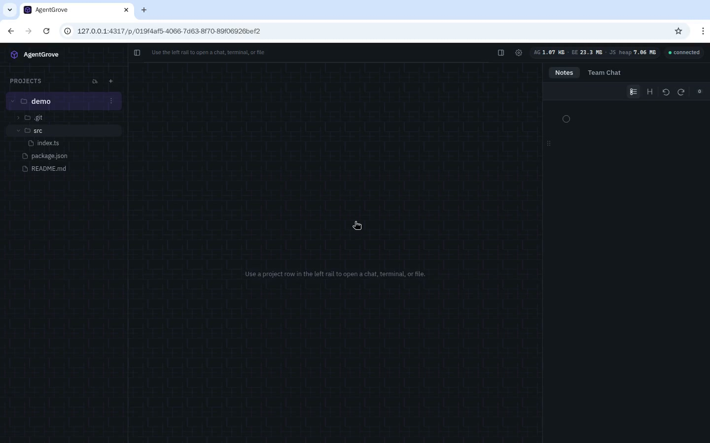

# AgentGrove

[](https://github.com/arnabk/agentgrove/actions/workflows/ci.yml)
[](https://github.com/arnabk/agentgrove/actions/workflows/release.yml)
[](https://github.com/arnabk/agentgrove/actions/workflows/nightly.yml)

High-performance, low-footprint, open-source local developer workspace.
Rust backend + SolidJS frontend. Cross-platform (Linux, macOS, Windows).

## Demo

One recording, most of the important features end to end — real captures of the live app, recorded inside the isolated Docker demo stack so the host dev server is untouched. Click to watch:

<video src="https://github.com/arnabk/agentgrove/raw/main/docs/demos/agentgrove-demo.mp4" poster="./docs/demos/agentgrove-demo-thumb.jpg" controls muted width="100%"></video>

[](https://github.com/arnabk/agentgrove/raw/main/docs/demos/agentgrove-demo.mp4)

The walkthrough covers, in order: workspace overview, AI chat, prompt queue, worktree sessions, integrated terminal, database editor, file search, git diff, notes, team chat, settings, revert-with-AI, and layout toggles.

## Quick Start

```sh
# Install prerequisites (macOS with Homebrew)
brew install node pnpm just
# Rust toolchain — project pins 1.95 via rust-toolchain.toml
curl --proto '=https' --tlsv1.2 -sSf https://sh.rustup.rs | sh

# Clone and run
git clone https://github.com/arnabk/agentgrove.git
cd agentgrove
just dev    # starts BE (hot reload) + FE (HMR) on http://localhost:5173
```

On Linux, install the same packages with your distro's package manager (e.g., `apt install nodejs pnpm` or `pacman -S node pnpm just`). Windows users can use `winget install Rustlang.Rustup OpenJS.NodeJS pnpm.just` or the [rustup](https://rustup.rs/) and [pnpm](https://pnpm.io/installation) installers.

## Features

A complete tour of what AgentGrove can do today. See [docs/features.md](docs/features.md) for the same list with extra detail.

### Project Management

- **Folder-based projects** — add any folder; name auto-derived from the path
- **BE-driven folder picker** — browse the filesystem from the UI; no native file dialog
- **Multi-project support** — multiple projects open at once with independent expand/collapse
- **Per-project settings** — pre-worktree scripts, inherited by every worktree
- **Project-scoped state** — each project/worktree gets its own tabs, editor state, and chat history

### Git & Worktrees

- **Git worktree management** — create, rename, delete worktrees from the UI
- **Remote-only worktrees** — gated on projects with a configured git remote; pre-fetches latest first
- **Pre/post scripts** — run setup commands (e.g. `pnpm install`) with live console output
- **Worktree history** — soft-deleted worktrees can be searched and restored (with chat recovery)
- **Branch switching** — switch branches from the UI with a branch picker
- **Celestial branch names** — worktrees named after stars, planets, and galaxies
- **Galaxy Map** — a zoomable map of the worktrees you've visited, preserved across removals
- **VSCode-style git diff** — staged/unstaged groups with inline CodeMirror merge view
- **Per-file discard** — restore tracked files or delete untracked, with confirmation

### Editor

- **CodeMirror 6 editor** — syntax highlighting for JS/TS, JSON, Markdown, Rust, and more
- **Autosave** — debounced 600ms + blur + file-switch + Cmd/Ctrl+S; no save button
- **Code folding** — fold/unfold with gutter markers and keyboard shortcuts
- **File size guard** — large files blocked to prevent crashes

### Terminal

- **WebSocket-powered terminal** — bidirectional WS for instant output and keystrokes
- **Multiple terminals** — unlimited terminal tabs per project/worktree
- **Per-project cwd** — terminals open in the correct project or worktree directory
- **Auto-close on exit** — Ctrl+D / `exit` closes the tab within ~200ms
- **Session persistence** — sessions survive page refresh (PTY stays alive on BE)
- **Bounded scrollback** — 2000-line ring buffer keeps the footprint stable
- **Resize sync** — xterm dimensions synced to the backend PTY on window resize

### AI Chat

- **Multi-provider** — Claude, opencode, and Kimi via CLI subprocess passthrough (user-authenticated)
- **Live model discovery** — models fetched live from providers with cache + manual refresh
- **Per-chat settings** — model, effort (thinking level), slash commands configurable per chat
- **Streaming responses** — real-time token streaming over WebSocket with coalescing
- **Markdown rendering** — assistant output via `marked` + `DOMPurify`; syntax-highlighted code
- **Thinking blocks** — extended-thinking events rendered as collapsible disclosures
- **Tool activity rail** — tool calls shown as icon + name + command preview rows
- **File upload & paste** — drag-drop, paste, or attach files; paths appended to the prompt
- **Chat forking** — fork a conversation from any point to explore a different direction
- **Message resend** — re-trigger any user message to re-run it through the agent
- **Prompt revert** — ask AI to undo the file changes a specific prompt produced
- **Delete from point** — truncate the conversation from any prompt onward
- **`/compact`** — summarize the conversation and start a fresh provider session in place
- **Session resume + recovery** — Claude `--resume`, opencode `--session` + `--dir`, Kimi `--session`; stale opencode sessions auto-recover and retry with recent context
- **Slash commands** — `/` menu with provider commands + user-defined prompt templates
- **PR detection** — auto-detects GitHub PR URLs in agent output; shows a PR badge
- **Auto-approve tools** — `--dangerously-skip-permissions` with per-chat override
- **Stop button** — cancel in-flight agent turns; kills the CLI subprocess cleanly

### Prompt Queue

- **Per-chat queue** — messages sent while AI is busy auto-enqueue
- **Auto-drain / manual mode** — dispatch back-to-back, or hold until explicit "Run next"
- **Inline editing** — double-click queue items to edit text; attachments preserved
- **Reorder** — drag queue items up/down to change execution order
- **Right-side dock** — always-visible, resizable queue panel inside the chat pane

### Database

- **Left-rail Database view** — connections + tables tree next to Projects (activity-bar style)
- **Connection manager** — saved Postgres connections with inline **Test** button
- **First-run seed** — a local connection is created from the server default and auto-connected
- **Tables browser** — filterable list; paginated data grid (50/page) with column filters
- **SQL editor** — CodeMirror 6 with SQL highlighting and schema autocomplete; Ctrl/Cmd+Enter runs
- **Safe dynamic results** — SELECTs wrapped server-side so any row shape renders; DML reports affected rows

### Notes / Scratchpad

- **Per-project rich-text scratchpad** — Tiptap: headings, bullets, numbers, checkboxes, code, quotes, links
- **Drag-to-reorder** — grab handle in the left gutter to move blocks
- **Autosave** — debounced with blur/visibility flush; never overwrites non-empty with empty
- **Cross-instance sync** — edits propagate to other tabs/windows via WebSocket

### Team Chat

- **Real-time communication** — chat with other developers on the same dev instance
- **WebSocket delivery** — instant message broadcast via existing `/ws` channels
- **Unread badges** — cross-browser unread indicators
- **Persistent history** — saved to the local SQLite database

### Reusable Prompt Templates

- **Settings → Prompts** — CRUD for named prompt templates
- **Default seeds** — ships with templates (Create PR, Code review, Explain, Write tests, Refactor, Debug, Commit message, Summarize, Merge from remote)
- **Quick picker** — sparkle icon in chat input for instant insertion

### File Search (Cmd+P)

- **Fuzzy file finder** — `nucleo-matcher` powered; sub-10ms search across 100k files
- **Gitignore-aware** — uses the `ignore` crate's parallel walker (same as ripgrep)
- **Live index** — per-project file index with manual refresh

### Settings & Themes

- **Tabbed modal** — Appearance, Prompts, Providers, Agents, Backups
- **Built-in themes** — Dark, Light, Solarized, Tokyo Night, plus a Material Dark design system
- **Custom themes** — create and persist personal color themes, applied live across the app
- **Fonts & size** — 10+ Google Font presets for UI/mono; global 12–28px size control
- **Provider management** — CLI detection status; HTTP providers have config forms
- **Auto-approve toggle** — global default with per-chat override
- **Database backups** — list snapshots, restore with confirmation, auto-snapshot before migrations

### Memory & Performance

- **Memory indicator** — top-right pill showing app-attributable, BE (Rust RSS), and JS+DOM breakdown
- **Client memory-growth monitor** — samples heap/DOM/WS every 15s; WARN on sustained climb
- **Bounded retention** — windowed chat store (600 prompts / 400 events per prompt) + virtualized timeline
- **Delta terminal streaming** — WS output instead of HTTP poll loops

### Cross-Instance Sync

- **WebSocket broadcast** — project/worktree/chat/notes mutations propagate to all clients
- **Echo suppression** — self-echo guard prevents reload loops on your own edits
- **Layout persistence** — per-scope UI state persisted to the BE via the layout API

### Data Safety

- **SQLite persistence** — chats, prompts, events, queue, and layout survive BE restarts
- **Auto-snapshots** — DB snapshotted before every migration; rotated to the last 10
- **Forward-only migrations** — pre-commit hook + CI guard prevent editing applied migrations
- **Restore CLI** — `just restore-db <name>` to recover from any snapshot
- **Encrypted secrets** — provider API keys encrypted at rest with XChaCha20-Poly1305

### Developer Experience

- **Release notifications** — in-app toast when a new GitHub release is available
- **Hot reload** — `just dev` runs BE (cargo-watch) + FE (Vite HMR) together
- **Cross-platform** — Linux/macOS/Windows; `.sh` + `.ps1` script pairs; `PathBuf` only
- **Draggable panels** — left rail, right sidebar, and queue dock all resizable
- **Open in OS file manager** — reveal any project/worktree folder in Finder/Explorer/Files
- **Custom dialogs** — themed `confirm`/`alert` replace all native dialogs
- **URL routing** — scope/pane/chat/file encoded in the URL; refresh restores deep state

### Quality & Open Source

- **MIT licensed** with a contributing guide, Code of Conduct, and security policy
- **Tested** — BE endpoint e2e tests + FE Playwright specs; route inventory enforced in CI
- **3 green CI badges** — CI, Release, Nightly; cross-platform nightly matrix
- **Auto-release** — every merge to main bumps the version and builds 4-platform binaries + a GitHub Release
- **ADRs** — architecture decision records documenting key choices

## Documentation

All detailed docs live under [`docs/`](./docs/):

- [Features](./docs/features.md)
- [Roadmap (working draft)](./docs/roadmap/README.md)
- [Architecture](./docs/architecture/overview.md)
- [Contributing](./docs/CONTRIBUTING.md)
- [Local dev guide](./docs/guides/local-dev.md)
- [Agent providers](./docs/guides/agent-providers.md)
- [Chat & queue routing](./docs/architecture/chat-queue-routing.md)
- [Data safety & restore](./docs/operations/data-safety.md)
- [Comparison with other tools](./docs/comparison.md)
- [ADRs](./docs/adr/)

## License

[MIT](./LICENSE)
